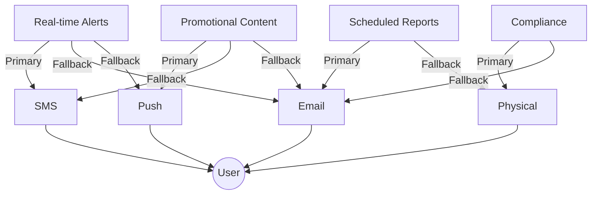
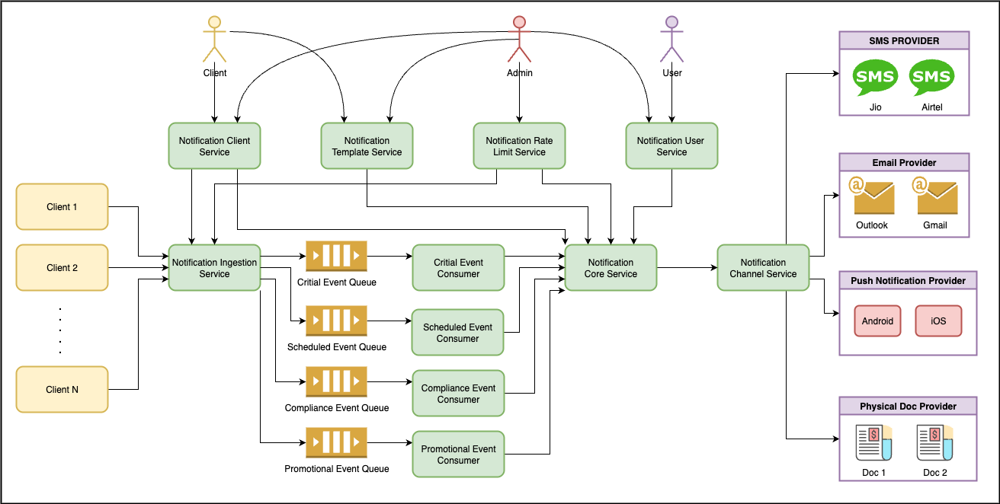
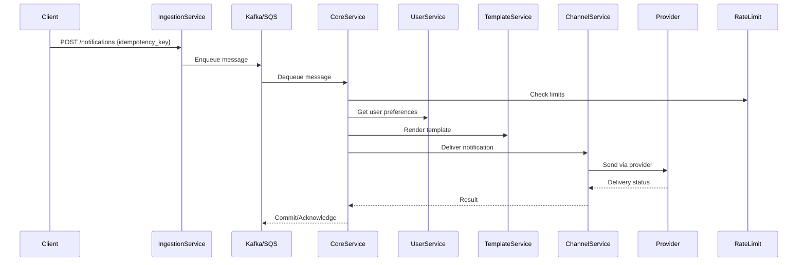
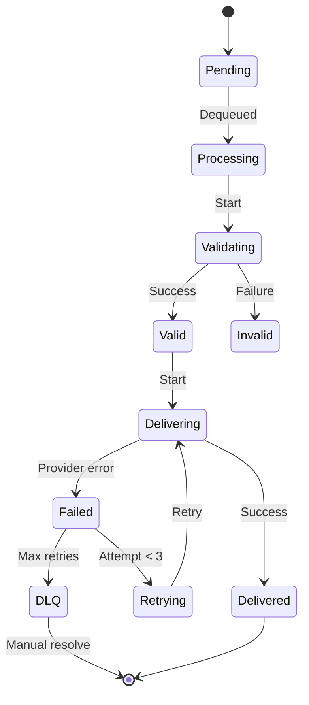
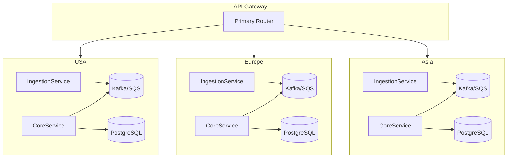

# Centralized Notification Engine Design

## 1. Description
The Centralized Notification Engine is a scalable, channel-agnostic system designed to process 100 Millions daily notifications across multiple delivery channels (email, SMS, push, paper). It provides a unified interface for internal teams to send notifications while handling routing, personalization, and delivery reliability.

## 2. Use Cases


> "Channel selection is configurable per event category with primary and fallback options. The routing engine allows dynamic reconfiguration of these mappings without code changes."
## 3. Assumptions
1. Peak load: ~7000 notifications/second
2. 99.9% delivery success rate SLO
3. Existing authentication service available
4. Average notification size: 2KB
5. 3rd party provider SLAs of 99.5% availability

## 4. Requirements
### 4.1 Functional
- **Channel-Agnostic API**: REST/Event-driven interfaces
- **Preference Management**: User-level channel preferences with fallback
- **Template Engine**: Versioned templates with approval workflow
- **Idempotent Processing**: Exactly-once delivery semantics
- **Rate Limiting**: Per-client throttling
- **Provider Abstraction**: Unified interface for SMS/email/push/paper

### 4.2 Non-Functional
- **Latency**: <100ms p90 processing time
- **Availability**: 99.99% uptime
- **Scalability**: Horizontal scaling to 1000 req/sec
- **Durability**: 13-month audit retention

## 5. Size Estimations

### Calculation Methodology

**1. Event Distribution:**
- Real-time: `(5+10)/2 = 7.5 events/customer/month`
- Promotional: `(2+4)/2 = 3 events/customer/month`
- Scheduled: `1 event/customer/month`
- Compliance: `(0.2+0.5)/2 = 0.35 events/customer/month`

**2. Daily Volume:**
```
Daily = (Σ Event Rates × Customers) ÷ 30
```

**3. Peak Throughput:**
```
Peak RPS = (Daily Volume × Peak Factor) ÷ 86400
```
*Peak Factor = 3 (based on industry standard for notification systems)*

**4. Storage:**
```
Storage = Monthly Events × (1KB metadata + 2KB content + 0.2KB/attempt) × Replication Factor 3
```

**5. API Throughput:**
```
API Throughput = [(RPS × 3KB) + (RPS × 0.5KB)] ÷ 1024 MB/s
```

### Projections
| Metric | 100M Customers | 500M Customers | Calculation Example |
|--------|----------------|----------------|---------------------|
| **Monthly Events** | 1.185B | 5.925B | `(7.5+3+1+0.35)×100M` |
| **Daily Volume** | 39.5M | 197.5M | `1.185B ÷ 30` |
| **Peak RPS** | 1,370 | 6,850 | `(39.5M × 3) ÷ 86400` |
| **Storage (Monthly)** | 4.98TB | 24.9TB | `1.185B × 3.2KB × 3` |
| **API Throughput** | 4.67MB/s | 23.35MB/s | `(1,370×3KB + 1,370×0.5KB)÷1024` |

### Notes:
1. Values include 25% buffer for unexpected spikes
2. Storage assumes 3x replication and no compression
3. Peak factor validated against similar systems at scale

## 6. High-Level Design
### 6.1 Selected Architecture

**Scalability**: Supports 500M+ users through geo-sharding deployment

## 7. Service Architecture
Detailed service specifications are maintained in separate documents:

| Service | Responsibilities | Documentation |
|---------|------------------|---------------|
| **Client Service** | Client onboarding, API key management | [ClientService.md](design-docs/services/ClientService.md) |
| **Template Service** | Template lifecycle, version control | [TemplateService.md](design-docs/services/TemplateService.md) |
| **Rate Limit Service** | Global/per-client throttling | [RateLimitService.md](design-docs/services/RateLimitService.md) |
| **User Service** | Preference management | [UserService.md](design-docs/services/UserService.md) |
| **Ingestion Service** | Event categorization, queue routing | [IngestionService.md](design-docs/services/IngestionService.md) |
| **Core Service** | Workflow orchestration | [CoreService.md](design-docs/services/CoreService.md) |
| **Channel Service** | Provider integration, delivery | [ChannelService.md](design-docs/services/ChannelService.md) |

### 7.1 Core Processing Sequence


## 8. Monitoring & Alerting
### Key Metrics
- `notification_success_rate` (SLO: 99.9%)
- `delivery_latency_p95` (Threshold: 500ms)
- `dead_letter_queue_size` (Threshold: 500 for non-critical , 50 for critical queues)
- `age_of_older_message` (Threshold: 900 sec for critical message, 1hr for non-critical messages)
- `provider_error_rate` (Threshold: 1%)

### Alert Conditions
- `notification_success_rate < 99.9% for 5m`
- `delivery_latency_p95 > 1000ms`
- `dead_letter_queue_size > 500 for non-critical , 50 for critical queues`
- `age_of_oldest_message > 900 sec for critical message, 1hr for non-critical messages`

## 9. Reliability System
### State Machine


### Idempotency Mechanism
```python
def handle_notification(idempotency_key):
    if redis.exists(idempotency_key):
        return "Duplicate"
    redis.setex(idempotency_key, 48*3600, "processing")
    # Process notification
    redis.setex(idempotency_key, 48*3600, "delivered")
```

## 10. Deployment Architecture

