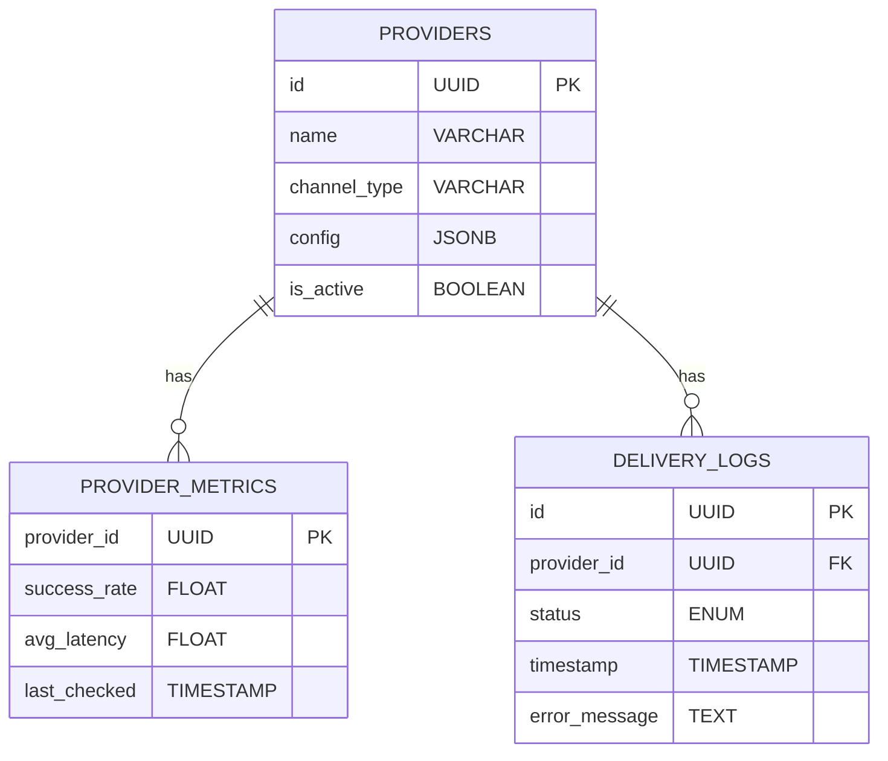

# Channel Service Design

## 1. Responsibilities
- Abstract provider integrations (SMS, email, push, etc.)
- Select optimal provider based on cost, reliability, and region
- Execute message delivery with automatic retries
- Monitor provider health and performance
- Handle provider-specific configurations

## 2. APIs
### 2.1 Internal APIs
| Endpoint | Method | Parameters | Description |
|----------|--------|------------|-------------|
| `/internal/channel/send` | POST | `{ channel, message, recipient }` | Deliver notification via channel |
| `/internal/channel/status` | GET | `provider_id` | Get provider health status |

### 2.2 Admin APIs
| Endpoint | Method | Access Level | Description |
|----------|--------|--------------|-------------|
| `/admin/providers` | POST | Admin | Add new provider |
| `/admin/providers/{id}/config` | PUT | Admin | Update provider config |
| `/admin/providers/{id}/status` | PATCH | Operator | Disable/enable provider |

## 3. Data Model


## 4. Key Algorithms
- **Provider Selection**:
  ```python
  def select_provider(channel, region):
      providers = get_active_providers(channel)
      providers = filter_by_region(providers, region)
      return sort_by_cost_and_reliability(providers)[0]
  ```
- **Retry with Fallback**:
  - Retries with next-best provider on failure

## 5. Error Handling
| Code | Message | Retryable | HTTP Status |
|------|---------|-----------|-------------|
| CHANNEL_4001 | Provider unavailable | Yes | 503 |
| CHANNEL_4002 | Invalid channel configuration | No | 400 |
| CHANNEL_4003 | Delivery timeout | Yes | 504 |
| CHANNEL_4004 | Unsupported channel | No | 400 |

## 6. Dependencies
- External provider APIs (Twilio, SendGrid, etc.)
- Monitoring Service: Delivery metrics
- Geo Service: Regional provider selection
- Rate Limit Service: Provider-specific throttling
