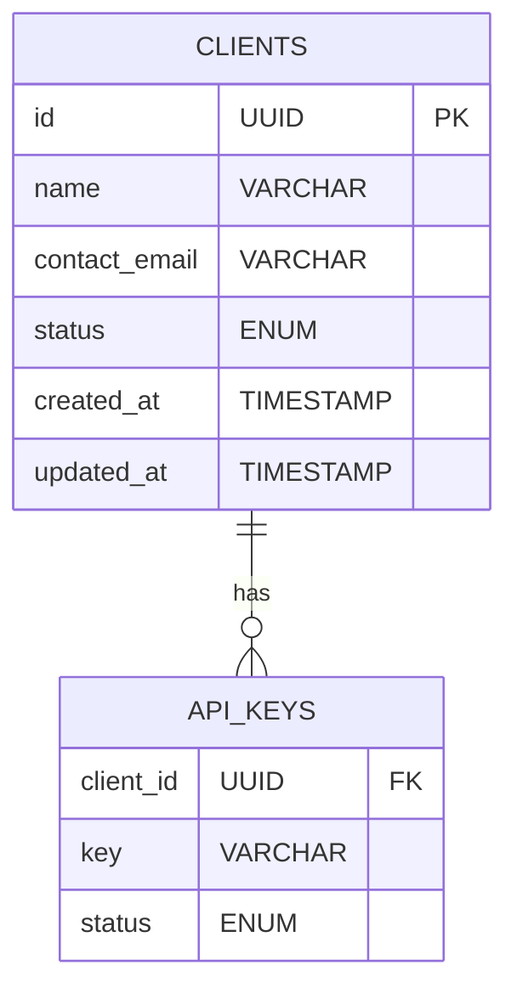
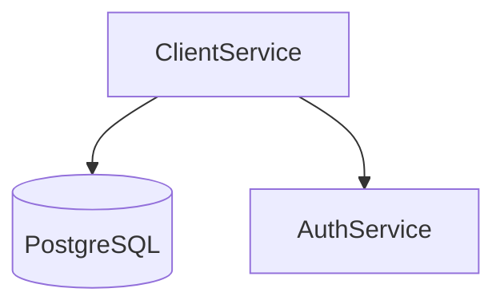

# Client Service Design

## 1. Responsibilities
- Client onboarding and offboarding
- API key management and rotation
- Rate limit configuration per client
- Client metadata management

## 2. APIs
### 2.1 Internal APIs
| Endpoint | Method | Parameters | Description |
|----------|--------|------------|-------------|
| `/internal/clients` | POST | `{ name, contact, rate_limit }` | Register new client |
| `/internal/clients/{id}` | GET | - | Get client details |

### 2.2 Admin APIs
| Endpoint | Method | Access Level | Description |
|----------|--------|--------------|-------------|
| `/admin/clients` | GET | Admin | List all clients |
| `/admin/clients/{id}/rate-limits` | PUT | Admin | Update rate limits |
| `/admin/clients/{id}/status` | PATCH | Admin | Update client status |

## 3. Data Model


**Note**: Rate limit configuration moved to Rate Limit Service

## 4. Key Algorithms
- **API Key Generation**:
  ```python
  def generate_api_key():
      return secrets.token_urlsafe(32)
  ```
- **Rate Limit Configuration**:
  - Uses token bucket algorithm with configurable burst

## 5. Error Handling
| Code | Message | Retryable | HTTP Status |
|------|---------|-----------|-------------|
| CLIENT_4001 | Client not found | No | 404 |
| CLIENT_4002 | Invalid rate limit value | No | 400 |
| CLIENT_4003 | API key quota exceeded | Yes | 429 |

## 6. Dependencies
- PostgreSQL: Primary data store
- Redis: Rate limit counters

## 7. Deployment Architecture


## 8. Size Estimations
- **Storage**: 
  - Clients: 1000 × 1KB = 1MB
  - API Keys: 3000 × 0.5KB = 1.5MB
  - **Total**: 2.5MB
- **Throughput**: 
  - 50 requests/sec × 2KB = 100KB/s
- **Memory**: 
  - 512MB per instance × 2 replicas = 1GB
