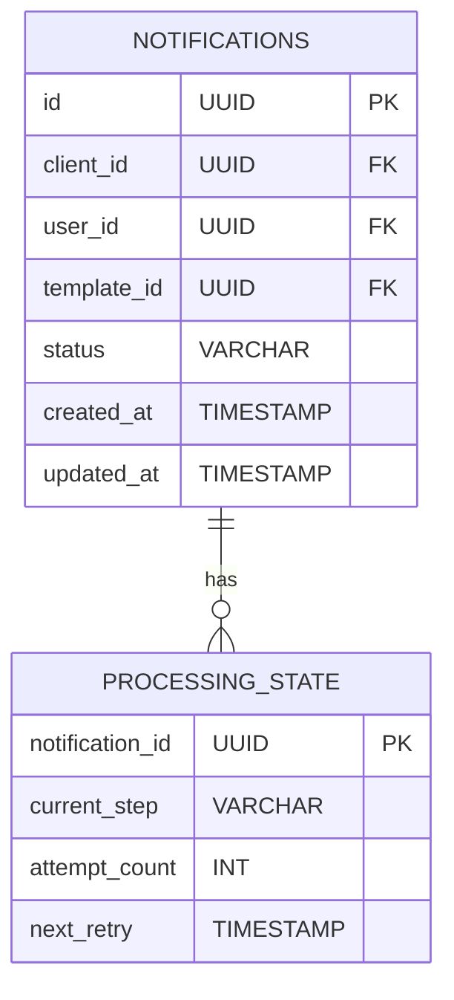

# Core Service Design

## 1. Responsibilities
- Orchestrate notification processing workflow
- Coordinate interactions between services
- Manage notification state and lifecycle
- Handle error recovery and retries
- Ensure idempotency and transaction integrity

## 2. APIs
### 2.1 Internal APIs
| Endpoint | Method | Parameters | Description |
|----------|--------|------------|-------------|
| `/internal/process` | POST | `{ event }` | Process queued notification event |
| `/internal/retry` | POST | `{ notification_id }` | Retry failed notification |

### 2.2 Admin APIs
| Endpoint | Method | Access Level | Description |
|----------|--------|--------------|-------------|
| `/admin/process/status` | GET | Operator | Get processing metrics |
| `/admin/notifications/{id}` | GET | Support | Get notification state |
| `/admin/retry/queue` | POST | Admin | Queue bulk retries |

## 3. Data Model


**Status Enums**:
- `PENDING`: Initial state after ingestion
- `PROCESSING`: Currently being processed
- `DELIVERED`: Successfully delivered
- `FAILED`: Permanent failure
- `RETRYING`: Scheduled for retry
- `DLQ`: In dead-letter queue

**Processing Steps**:
- `VALIDATING`: Verifying input data
- `TEMPLATING`: Rendering content
- `RATE_CHECK`: Applying rate limits
- `DELIVERING`: Sending via channel
- `COMPLETED`: Final state

## 4. Key Algorithms
- **Processing Workflow**:
  ```python
  def process_event(event):
      validate(event)
      preferences = get_preferences(event.user_id)
      template = render_template(event.template_id, event.parameters)
      if rate_limit_exceeded(event):
          delay_processing(event)
      else:
          deliver(event, preferences, template)
  ```
- **Retry Strategy**:
  - Exponential backoff

## 5. Error Handling
| Code | Message | Retryable | HTTP Status |
|------|---------|-----------|-------------|
| CORE_4001 | Processing failed | Yes | 500 |
| CORE_4002 | Invalid state transition | No | 409 |
| CORE_4003 | Dependency unavailable | Yes | 503 |
| CORE_4004 | Data inconsistency | No | 500 |

## 6. Dependencies
- All other notification services
- Kafka/SQS: Event consumption
- PostgreSQL: State persistence
- Redis: Idempotency keys
