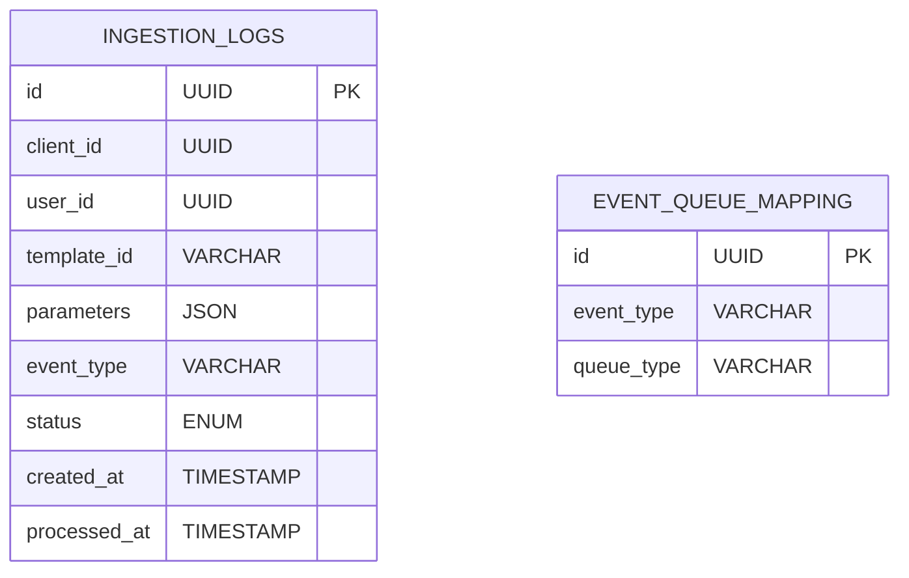

# Ingestion Service Design

## 1. Responsibilities
- Validate incoming notification requests
- Authenticate and authorize client requests
- Categorize events into types (critical, scheduled, compliance, promotional)
- Route events to appropriate queues
- Apply initial rate limiting checks

## 2. APIs
### 2.1 Core APIs
| Endpoint | Method | Parameters | Description |
|----------|--------|------------|-------------|
| `/v1/notifications` | POST | `{ client_id, user_id, template_id, parameters }` | Primary notification ingestion endpoint |

### 2.2 Admin APIs
| Endpoint | Method | Access Level | Description |
|----------|--------|--------------|-------------|
| `/admin/ingestion/queues` | GET | Admin | Get queue status and metrics |
## 3. Data Model


## 4. Key Algorithms
- **Event Categorization**:
  ```python
  def categorize_event(event):
      if event.get('urgent'):
          return 'critical'
      elif event.get('scheduled_time'):
          return 'scheduled'
      # Additional rules
  ```
- **Queue Selection**:
  - Uses routing rules to select target queue

## 5. Error Handling
| Code | Message | Retryable | HTTP Status |
|------|---------|-----------|-------------|
| INGEST_4001 | Invalid request format | No | 400 |
| INGEST_4002 | Unauthorized client | No | 401 |
| INGEST_4003 | Event too large | No | 413 |
| INGEST_4004 | System overloaded | Yes | 503 |

## 6. Dependencies
- Kafka/SQS: Event queues
- Client Service: Client authentication
- Rate Limit Service: Initial throttling
