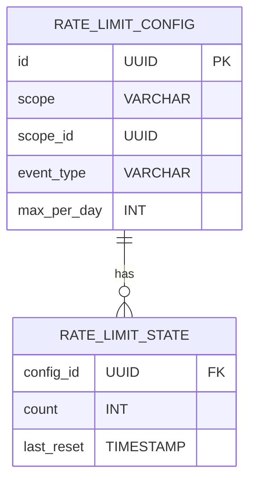
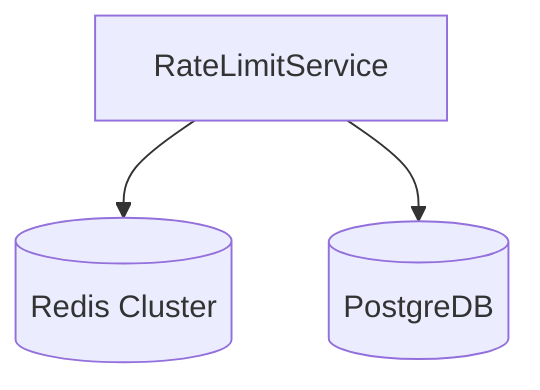

# Rate Limit Service Design

## 1. Responsibilities
- Per-client request throttling
- User-level request quota management
- Real-time rate limit analytics

## 2. APIs
### 2.1 Internal APIs
| Endpoint | Method | Parameters | Description |
|----------|--------|------------|-------------|
| `/internal/rate-limit/check` | POST | `{ client_id, count }` | Check and consume rate limit tokens |
| `/internal/rate-limit/stats` | GET | `client_id` | Get current rate limit stats |

### 2.2 Admin APIs
| Endpoint | Method | Access Level | Description |
|----------|--------|--------------|-------------|
| `/admin/rate-limit/clients/{id}` | PUT | Admin | Update client rate limits |
| `/admin/rate-limit/users/{id}` | PUT | Admin | Update user rate limits |
| `/admin/rate-limit/reset` | POST | Admin | Reset rate limits |

## 3. Data Model


**Notes**:
1. Critical/Compliance events have NULL max_per_day (unlimited)
2. Daily counts reset at 00:00 UTC
3. Scope defines client-level or user-level limits

## 4. Key Algorithms
- **Daily Rate Check**:
  ```python
  def check_daily_limit(scope, scope_id, event_type, count=1):
      # Skip critical and compliance events
      if event_type in ['CRITICAL', 'COMPLIANCE']:
          return True
          
      # Get current count and limit
      current_count = get_daily_count(scope_id, event_type)
      max_limit = get_max_limit(scope, scope_id, event_type)
      
      # Check if within limit
      if current_count + count <= max_limit:
          increment_count(scope_id, event_type, count)
          return True
      return False
  ```
  
- **Count Reset**:
  ```python
  def reset_daily_counts():
      # Runs daily at 00:00 UTC
      for key in redis.scan_iter("rate_limit:*"):
          if key.endswith(":count"):
              redis.delete(key)
  ```

## 5. Error Handling
| Code | Message | Retryable | HTTP Status |
|------|---------|-----------|-------------|
| RATE_4001 | Rate limit exceeded | Yes | 429 |
| RATE_4002 | Invalid configuration | No | 400 |
| RATE_4003 | Service not configured | No | 404 |

## 6. Dependencies
- Redis: Rate limit state storage
- Client Service: Client metadata
- Monitoring Service: Rate limit metrics

## 7. Deployment Architecture


## 8. Size Estimations
- **Storage**: 
  - Config: 10,000 rules × 0.5KB = 5MB
  - State: 1M counters × 0.1KB = 100MB
  - **Total**: 105MB
