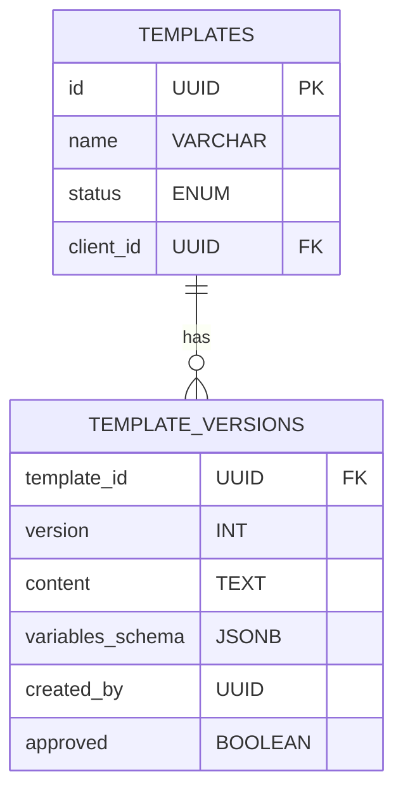
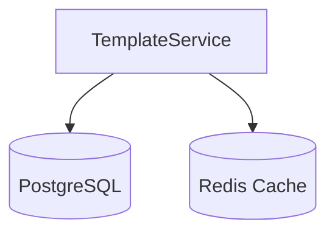

# Template Service Design

## 1. Responsibilities
- Template lifecycle management (create/update/archive)
- Version control and history tracking
- Approval workflow enforcement
- Template validation and variable schema management

## 2. APIs
### 2.1 Internal APIs
| Endpoint | Method | Parameters | Description                                    |
|----------|--------|------------|------------------------------------------------|
| `/internal/templates` | POST | `{ name, content, variables }` | Create new template                            |
| `/internal/templates/{id}/render` | POST | `{ parameters }` | Render customer facing template with variables |

### 2.2 Admin APIs
| Endpoint                         | Method | Access Level | Description                     |
|----------------------------------|--------|--------------|---------------------------------|
| `/admin/templates/{id}/versions` | GET | Editor | List template versions          |
| `/admin/templates/{id}/workflow` | POST | Approver | Approve/Reject template version |

## 3. Data Model


## 4. Key Algorithms
- **Template Rendering**:
  ```python
  def render_template(template, parameters):
      return template.format(**parameters)
  ```
- **Schema Validation**:
  - Validates input parameters against JSON schema

## 5. Error Handling
| Code | Message | Retryable | HTTP Status |
|------|---------|-----------|-------------|
| TEMPLATE_4001 | Invalid variable schema | No | 400 |
| TEMPLATE_4002 | Template not found | No | 404 |
| TEMPLATE_4003 | Approval required | No | 403 |

## 6. Dependencies
- PostgreSQL: Template storage
- Redis: Caching rendered templates
- Cache Service: Thin client caching for high-frequency access

**Thin Client Implementation**:
```python
class TemplateClient:
    def __init__(self, cache_size=1000):
        self.cache = LRUCache(cache_size)
    
    def get_template(self, template_id):
        if cached := self.cache.get(template_id):
            return cached
        template = requests.get(f"{BASE_URL}/templates/{template_id}")
        self.cache[template_id] = template
        return template
```

**Usage**: Core/Ingestion services use this client to cache templates

## 7. Deployment Architecture


## 8. Size Estimations
- **Storage**: 
  - Templates: 10,000 × 10KB = 100MB
  - Versions: 50,000 × 12KB = 600MB
  - **Total**: 700MB
- **Throughput**: 
  - 200 renders/sec × 5KB = 1MB/s
- **Memory**: 
  - 2GB per instance × 2 replicas = 4GB (caching)
