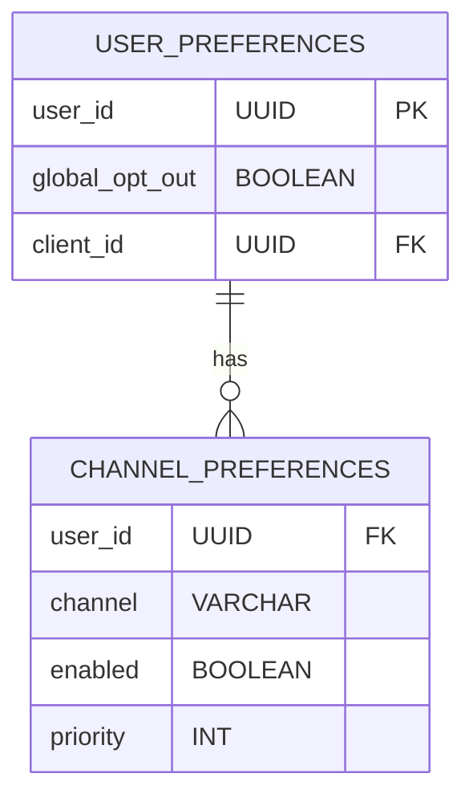
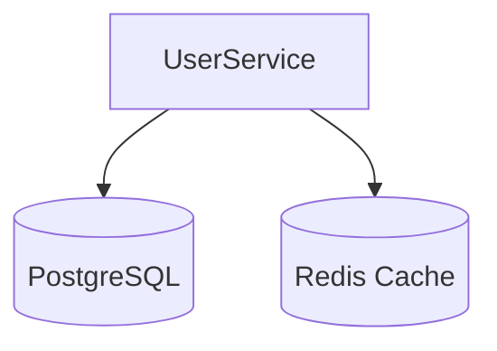

# User Service Design

## 1. Responsibilities
- Manage user notification preferences
- Handle global and channel-specific opt-in/out status
- Store and retrieve channel priority configurations
- Provide preference data to core services

## 2. APIs
### 2.1 Internal APIs
| Endpoint | Method | Parameters                                 | Description |
|----------|--------|--------------------------------------------|-------------|
| `/internal/users/preferences` | GET | `user_id`                                  | Get user preferences |
| `/internal/users/preferences` | PUT | `{ user_id, preferences, global_opt_out }` | Update preferences |

### 2.2 Admin APIs
| Endpoint | Method | Access Level | Description |
|----------|--------|--------------|-------------|
| `/admin/users/{user_id}/opt-out` | POST | Support | Global opt-out |
| `/admin/users/{user_id}/channels` | GET | Analyst | Get channel preferences |
| `/admin/users/bulk-update` | POST | Admin | Bulk update preferences |

## 3. Data Model


## 4. Key Algorithms
- **Preference Merging**:
  ```python
  def get_effective_preferences(user_id):
      global_prefs = get_global_prefs(user_id)
      client_prefs = get_client_prefs(user_id)
      return merge_prefs(global_prefs, client_prefs)
  ```
- **Fallback Calculation**:
  - Determines fallback channels when primary is unavailable

## 5. Error Handling
| Code | Message | Retryable | HTTP Status |
|------|---------|-----------|-------------|
| USER_4001 | User not found | No | 404 |
| USER_4002 | Invalid preference format | No | 400 |
| USER_4003 | Preference conflict | No | 409 |

## 6. Dependencies
- PostgreSQL: Preference storage
- Cache Service: Preference caching

## 7. Deployment Architecture


## 8. Size Estimations
- **Storage**: 
  - 100M users × 1KB = 100GB
  - Channel preferences: 500M × 0.5KB = 250GB
  - **Total**: 350GB
- **Throughput**: 
  - 500 preference lookups/sec × 2KB = 1MB/s
- **Memory**: 
  - 2GB per instance × 3 replicas = 6GB
